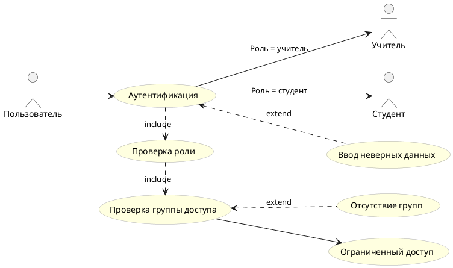
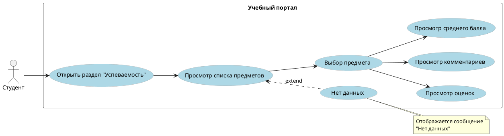
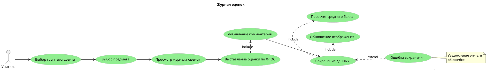
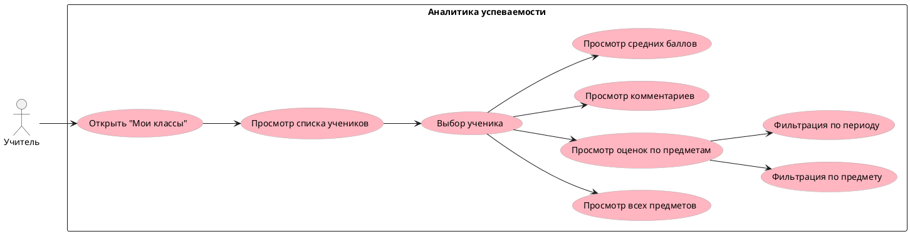

# **Документ функциональных требований**

---

## **1. ОБЗОР ПРОЕКТА**

### 1.1. Назначение документа
FRD описывает функциональные возможности, поведение системы и взаимодействие пользователей с системой «Электронный журнал учебного процесса» на основе предоставленной UML-диаграммы.

### 1.2. Цель системы
Автоматизация процессов выставления, хранения и просмотра учебных оценок, комментариев и данных о предметах с разделением прав доступа между преподавателями и учащимися.

---

## **2. ФУНКЦИОНАЛЬНЫЕ ТРЕБОВАНИЯ**

### **2.1. Глобальные сценарии использования (Use Cases)**

#### **UC-1: Аутентификация и авторизация**
**Актор:** Пользователь (учитель/студент)  
**Предусловие:** Пользователь не авторизован  
**Основной поток:**
1. Пользователь вводит логин/пароль.
2. Система проверяет соответствие с хранимыми профилями.
3. Если данные не совпадают — система предлагает повторный ввод.
4. После успешной проверки система определяет роль (учитель/студент).
5. Система проверяет наличие групп доступа (для учителей).
6. Если у учителя нет групп — доступ ограничивается.
7. Пользователь перенаправляется в соответствующий интерфейс.

**Альтернативный поток A:** Неверные данные → возврат к шагу 1 с сообщением об ошибке.  
**Постусловие:** Пользователь авторизован и имеет доступ к функциям согласно роли.

---

#### **UC-2: Просмотр учебных данных (студент)**
**Актор:** Студент  
**Предусловие:** Студент авторизован  
**Основной поток:**
1. Студент открывает раздел «Успеваемость».
2. Система отображает список предметов.
3. Студент выбирает предмет.
4. Система отображает:
   - Все оценки по предмету
   - Комментарии к оценкам
   - Средний балл по предмету
5. Студент может просматривать данные, но не может их изменять.

**Альтернативный поток:** Нет данных → отображение сообщения «Нет данных».  
**Постусловие:** Студент ознакомлен с учебной информацией.

---

#### **UC-3: Управление оценками (учитель)**
**Актор:** Учитель  
**Предусловие:** Учитель авторизован, имеет группу доступа  
**Основной поток:**
1. Учитель выбирает группу/студента.
2. Учитель выбирает предмет.
3. Система отображает журнал оценок по выбранному предмету.
4. Учитель выставляет новую оценку по системе ФГОС.
5. Учитель при необходимости добавляет комментарий.
6. Система сохраняет оценку и комментарий, пересчитывает средний балл.
7. Система обновляет отображение в реальном времени.

**Альтернативный поток:** Ошибка сохранения → уведомление учителя.  
**Постусловие:** Данные сохранены, студенты видят изменения.

---

#### **UC-4: Просмотр и анализ успеваемости (учитель)**
**Актор:** Учитель  
**Предусловие:** Учитель авторизован  
**Основной поток:**
1. Учитель открывает раздел «Мои классы».
2. Система отображает список учеников.
3. Учитель выбирает ученика.
4. Система отображает:
   - Все предметы ученика
   - Оценки по каждому предмету
   - Комментарии
   - Средние баллы
5. Учитель может фильтровать данные по предмету/периоду.

**Постусловие:** Учитель получил отчёт по успеваемости.

---

### **2.2. Подробные функциональные требования**

#### **FR-01: Управление пользователями**
- **FR-01.01:** Система должна поддерживать два типа профилей: «Учитель» и «Студент».
- **FR-01.02:** При входе система должна проверять соответствие введённых данных с хранимыми в БД.
- **FR-01.03:** При несовпадении данных система должна предлагать повторный ввод с сообщением «Данные не совпадают».
- **FR-01.04:** После успешного входа система должна определять роль пользователя и предоставлять соответствующий интерфейс.
- **FR-01.05:** Учитель без назначенных групп должен получать уведомление «У пользователя нет групп доступа» и ограниченный функционал.

#### **FR-02: Хранение данных**
- **FR-02.01:** Система должна хранить оценки с атрибутами:
  - ID ученика
  - ID предмета
  - Оценка (по шкале ФГОС)
  - Дата выставления
  - ID учителя
  - Комментарий (опционально)
- **FR-02.02:** Система должна автоматически рассчитывать средний балл ученика по каждому предмету и в целом.
- **FR-02.03:** Данные должны сохраняться в реляционной БД с поддержкой транзакций.

#### **FR-03: Функционал для студента**
- **FR-03.01:** Студент должен иметь возможность просматривать свои оценки по всем предметам.
- **FR-03.02:** Студент должен видеть комментарии учителей к оценкам.
- **FR-03.03:** Студент должен видеть список предметов, на которые он записан.
- **FR-03.04:** Студент должен видеть средний балл по каждому предмету и общий средний балл.
- **FR-03.05:** Студент **не должен** иметь возможности выставлять, изменять или удалять оценки.

#### **FR-04: Функционал для учителя**
- **FR-04.01:** Учитель должен видеть список учеников в своих группах.
- **FR-04.02:** Учитель должен иметь возможность просматривать оценки любого ученика из своей группы.
- **FR-04.03:** Учитель должен видеть список предметов, которые он ведёт.
- **FR-04.04:** Учитель должен иметь возможность выставлять оценки по системе ФГОС.
- **FR-04.05:** Учитель должен иметь возможность добавлять текстовые комментарии к оценкам.
- **FR-04.06:** Учитель должен видеть все комментарии (свои и других учителей) к оценкам учеников.

#### **FR-05: Процесс выставления оценок**
- **FR-05.01:** Система должна поддерживать шкалу оценивания согласно ФГОС (например: 2, 3, 4, 5 или 100-балльную).
- **FR-05.02:** При выставлении оценки система должна запрашивать обязательное указание предмета и ученика.
- **FR-05.03:** После сохранения оценки система должна автоматически пересчитывать средний балл ученика.
- **FR-05.04:** Все изменения должны логироваться (кто, когда, какую оценку поставил).

#### **FR-06: Выход из системы**
- **FR-06.01:** Пользователь должен иметь возможность выйти из системы в любой момент.
- **FR-06.02:** При выходе все несохранённые данные должны быть сохранены автоматически.
- **FR-06.03:** Сессия пользователя должна корректно завершаться.

---

### **2.3. Бизнес-правила**

| ID  | Правило | Описание |
|-----|---------|----------|
| BR-01 | Ролевой доступ | Только учителя могут выставлять оценки. Студенты — только просматривать. |
| BR-02 | Валидация оценок | Оценка должна соответствовать допустимой шкале ФГОС. |
| BR-03 | Группы доступа | Учитель без назначенных групп не может выставлять оценки. |
| BR-04 | Комментарии | Комментарии к оценкам не являются обязательными. |
| BR-05 | Средний балл | Рассчитывается автоматически при добавлении/изменении оценки. |

---

### **2.4. Требования к данным**

#### **Таблица пользователей**
| Поле | Тип | Обязательно | Описание |
|------|-----|-------------|----------|
| user_id | int | Да | Уникальный ID |
| login | varchar | Да | Логин для входа |
| password_hash | varchar | Да | Хэш пароля |
| role | enum(teacher, student) | Да | Роль пользователя |
| full_name | varchar | Да | ФИО |

#### **Таблица оценок**
| Поле | Тип | Обязательно | Описание |
|------|-----|-------------|----------|
| grade_id | int | Да | Уникальный ID оценки |
| student_id | int | Да | ID студента |
| teacher_id | int | Да | ID учителя |
| subject_id | int | Да | ID предмета |
| grade_value | int | Да | Значение оценки |
| comment | text | Нет | Комментарий учителя |
| date | date | Да | Дата выставления |

---

## **3. ИНТЕРФЕЙСЫ**

### **3.1. Пользовательский интерфейс**
- **UI-01:** Страница входа с полями: логин, пароль, кнопка «Войти».
- **UI-02:** Личный кабинет студента: боковое меню с разделами «Предметы», «Оценки», «Средний балл».
- **UI-03:** Панель учителя: журнал с фильтрами по группе/предмету, форма выставления оценки.
- **UI-04:** Модальное окно для добавления комментария к оценке.

### **3.2. Внешние интерфейсы**
- **API-01:** REST API для мобильного приложения (если потребуется в будущем).
- **INT-01:** Возможность интеграции с системой «Электронная школа» (задел на будущее).

---

## **4. ОГРАНИЧЕНИЯ И ДОПУЩЕНИЯ**

### **Ограничения:**
1. Система работает только в рамках одного учебного заведения (без поддержки многопользовательских организаций на первом этапе).
2. Нет функции регистрации новых пользователей через интерфейс — все профили создаются администратором.

### **Допущения:**
1. Учитель ведёт несколько предметов и групп.
2. Один студент может изучать несколько предметов.
3. Шкала ФГОС предполагает целочисленные значения от 2 до 5.

---

## **5. КРИТЕРИИ ПРИЕМКИ (FUNCTIONAL ACCEPTANCE CRITERIA)**

| ID  | Критерий | Статус тестирования |
|-----|----------|---------------------|
| FAC-01 | Студент может просмотреть свои оценки по всем предметам | [ ] |
| FAC-02 | Учитель может выставить оценку с комментарием | [ ] |
| FAC-03 | Средний балл пересчитывается автоматически | [ ] |
| FAC-04 | При неверном входе показывается ошибка | [ ] |
| FAC-05 | Учитель без групп видит сообщение об отсутствии доступа | [ ] |
| FAC-06 | Все данные сохраняются при выходе | [ ] |

---

**Версия документа:** 1.0  
**Дата составления:** [текущая дата]  
**Ответственный:** [ФИО аналитика]  
**Статус:** Согласовано