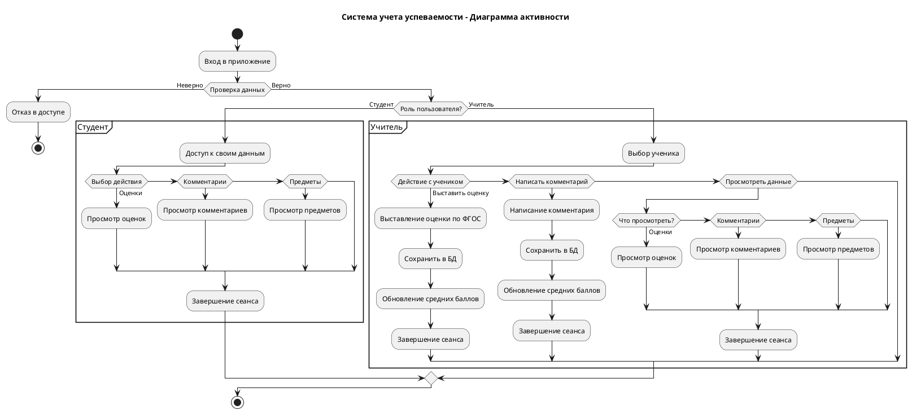
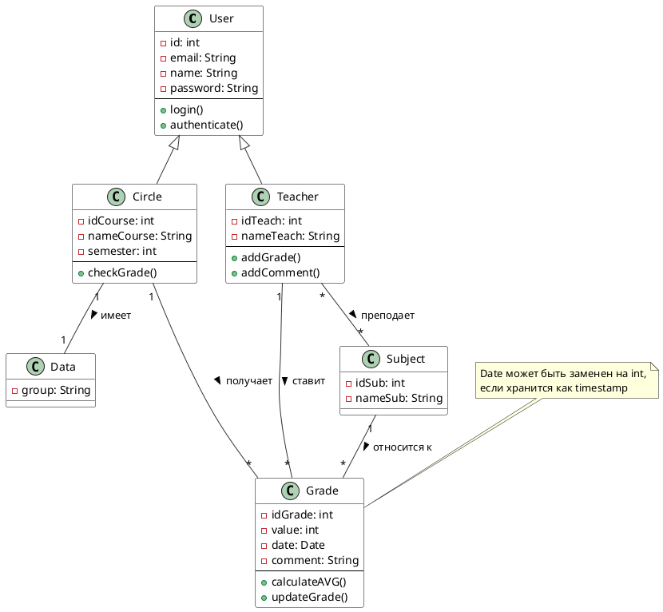

# Бизнес-требования для приложения по выставлению оценок в колледжах

## Общее описание

Бизнес-требования определяют минимальный функционал с авторизацией, ролевым разделением (преподаватель/студент СПО) и строгим соответствием ФГОС СПО (Федеральным государственным образовательным стандартам среднего профессионального образования), где оценивание ориентировано на демонстрацию освоения профессиональных компетенций (ПК), общепрофессиональных (ОПК) и общеобразовательных навыков по пятибалльной шкале с пороговыми значениями:

| Балл | Процент освоения |
|------|------------------|
| 5    | 86-100%          |
| 4    | 67-85%           |
| 3    | 48-66%           |
| 2    | 0-47%            |

Включая формирующее оценивание в процессе практики и итоговое по рабочим программам дисциплин. ФГОС СПО требует критериальной оценки по индикаторам успеха (знание теории, выполнение заданий, самоконтроль), обязательное обоснование баллов комментарием с привязкой к элементам профессиональных стандартов.

## Функциональные требования к авторизации и ролям

Система обеспечивает безопасный вход для пользователей колледжей с автоматическим определением роли, исключая несанкционированный доступ к данным оценки компетенций по ФГОС СПО.

Пользователь вводит логин/пароль; профиль содержит ID колледжа, специальность (например, 15.02.01 "Монтаж и эксплуатация оборудования"), группу, роль (преподаватель/студент). После входа роль определяется автоматически: преподаватель получает доступ к выставлению оценок по дисциплинам ППК (профессиональный цикл), студент — только к просмотру своих результатов по рабочим программам. 

**Дашборд адаптирован под СПО:**
- Для студента — список дисциплин специальности с оценками ПК/ОПК
- Для преподавателя — выбор студента/группы/дисциплины

## Функциональные требования к оценкам студентов (просмотр)

Студенты колледжей видят персонализированные результаты освоения компетенций по ФГОС СПО: оценки по дисциплинам с детализацией уровней достижения (базовый/повышенный/высокий).

Список дисциплин профессионального цикла (например, "Технология сварки", "Основы автоматизации") с оценками: дата выставления, балл по шкале ФГОС СПО (2-5), комментарий преподавателя, индикатор уровня компетенции (цветовой: зеленый для 4-5 как "готов к профессиональной деятельности", желтый для 3 как "требует доработки", красный для 2).

**Средний балл:**
- По предмету (арифметическое взвешенное с учетом веса тем, минимум 4 оценки для итоговой практики)
- Общий по специальности (с акцентом на ключевые ПК)

**Фильтры:** по периоду (модуль/семестр/год), сортировка по баллу/дате.

При клике на оценку открываются ФГОС-критерии СПО (пример: "ПК 1.1: выполнение сварки — 82%, уровень 4; освоены техники фиксации и контроля качества"), что способствует рефлексии и корректировке индивидуального учебного плана.

## Логика работы приложения

## Функциональные требования к оценкам преподавателей (выставление)
Выставление оценок строго привязано к ФГОС СПО: выбор уровня демонстрации компетенции → автоматический балл по пороговым значениям + обязательный комментарий с ссылкой на коды ПК/ОПК из рабочих программ дисциплин.

**Процесс:**
1. Преподаватель выбирает студента (поиск по ФИО/группе/специальности)
2. Дисциплину из профиля колледжа (с предзагруженным списком по ФГОС)

**Шкала оценки — только выпадающий список по ФГОС СПО:**
- "5 (86-100%: высокая демонстрация компетенции, самостоятельное применение в новых условиях)"
- "4 (67-85%: уверенная демонстрация, типовые ситуации)"
- "3 (48-66%: базовая демонстрация с поддержкой)"
- "2 (0-47%: компетенция не сформирована)"

**Обязательный комментарий (минимум 100 символов):** шаблоны по ФГОС СПО ("По ПК 2.2: выполнена лабораторная работа с отклонением 5%; рекомендую дополнительную практику по методу TIG"), с автопроверкой на ключевые элементы (код компетенции, индикаторы успеха, рекомендации).

**Сохранение:**
- Фиксирует дату/время
- Отправляет push-уведомление студенту ("Новая оценка по 'Автоматизация': 4 по ОПК 3")
- История правок доступна только преподавателю

**Ограничения ФГОС:**
- Не более одной оценки в неделю по дисциплине
- Итоговые по модулю — после минимума текущих (минимум 70% тем)
- Блокировка выставления без комментария

## Классы приложения

## Нефункциональные требования с фокусом на ФГОС СПО

Приложение гарантирует объективность, прозрачность и доступность оценивания по ФГОС СПО (Приказ Минпросвещения № 286/2014 с изменениями), с характеристиками для колледжей: оперативность на уроках/практиках, защиту данных по 152-ФЗ, простоту интерфейса для студентов 16-20 лет.

**Производительность:** менее 1 секунды на авторизацию, просмотр или сохранение оценки для оперативного использования на занятиях.

**Безопасность:**
- JWT-токены
- Ролевая модель RBAC (преподаватель — только свои группы, студент — только свой профиль)
- Шифрование персональных данных и логов аудита

**Интерфейс:**
- Responsive для мобильных/веб (iOS/Android)
- Интуитивный (максимум 3 клика до цели)
- Поддержка темной темы и крупным шрифтом

**Надежность:**
- 99.5% доступности
- Оффлайн-просмотр кэшированных оценок

**Полное соответствие ФГОС СПО:** экспорт в формат ФОС (PDF с критериями ПК/ОПК, рекомендациями для аттестационной комиссии).

## Требования к данным и интеграциям ФГОС СПО

**Структура базы данных:**
- пользователи (роль, специальность, группа)
- дисциплины (коды по ФГОС СПО, веса тем)
- оценки (студент_id, дисциплина, балл_фгос, процент_освоения, комментарий с кодом_ПК, дата, уровень_достижения)

**Предзагруженные данные:**
- Списки компетенций по 300+ специальностям СПО из федеральных программ
- Расчет среднего балла учитывает веса модулей практики

**Экспорт отчетов:**
- PDF-табель для сессии/практики
- Для работодателей — выдержки по ключевым ПК