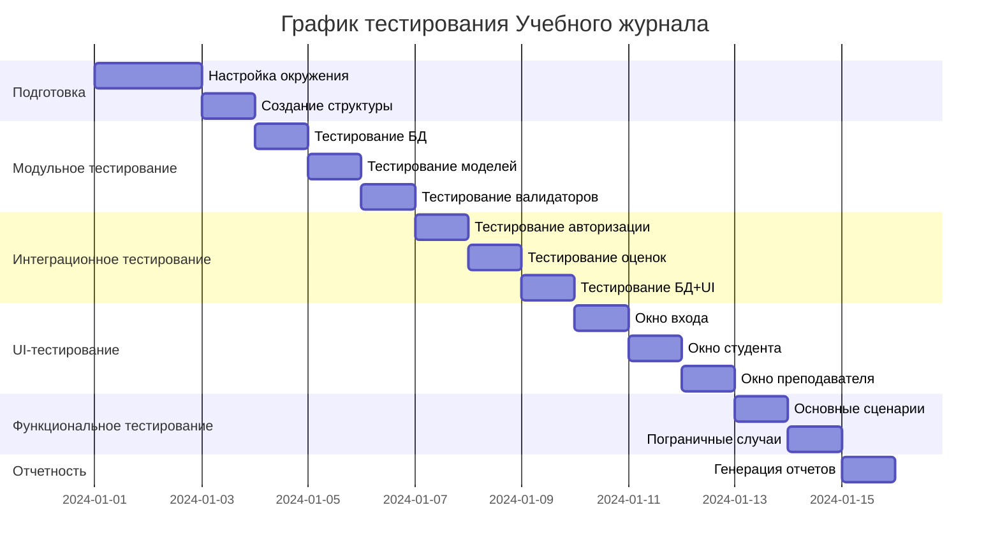

# 📋 План тестирования PyQt5 приложения "Учебный журнал"

## 1. Общая информация

**Название проекта:** Учебный журнал (PyQt5 desktop приложение)  
**Версия:** 1.0.0  
**Тип тестирования:** Функциональное, модульное, интеграционное, UI-тестирование  
**Цель:** Проверка корректности работы всех функций приложения  
**Сроки:** 2 недели  

## 2. Объекты тестирования

### 2.1 Модули:
- `database.py` - работа с SQLite базой данных
- `models.py` - модели данных
- `validators.py` - валидация входных данных
- `login_window.py` - окно авторизации
- `student_window.py` - личный кабинет студента
- `teacher_window.py` - панель преподавателя
- `main.py` - главный файл приложения

### 2.2 Основные функции:
- Авторизация пользователей
- Просмотр оценок (студент)
- Выставление оценок (преподаватель)
- Валидация данных
- Работа с базой данных

## 3. Виды тестирования

### 3.1 Модульное тестирование (Unit Testing)
**Цель:** Проверка отдельных функций и методов  
**Инструменты:** pytest, unittest  
**Охват:** 70% кода  

### 3.2 Интеграционное тестирование (Integration Testing)
**Цель:** Проверка взаимодействия модулей  
**Сценарии:** 
- Авторизация → открытие соответствующего окна
- Добавление оценки → обновление журнала
- Работа с БД → отображение данных в UI

### 3.3 UI-тестирование (User Interface Testing)
**Цель:** Проверка графического интерфейса  
**Инструменты:** pytest-qt  
**Что тестируем:** 
- Корректность отображения элементов
- Реакция на действия пользователя
- Валидация ввода данных

### 3.4 Функциональное тестирование (Functional Testing)
**Цель:** Проверка соответствия требованиям  
**Тест-кейсы:** 
- Все сценарии использования из ТЗ
- Пограничные случаи
- Обработка ошибок

## 4. План тестирования по этапам

### Этап 1: Подготовка (2 дня)
1. **Настройка окружения**
   - Установка Python 3.11+
   - Установка PyQt5
   - Установка pytest и зависимостей
   
2. **Создание структуры тестов**
   ```
   tests/
   ├── unit/           # Модульные тесты
   ├── integration/    # Интеграционные тесты  
   ├── ui/            # UI тесты
   ├── fixtures/      # Фикстуры
   └── reports/       # Отчеты
   ```

3. **Написание фикстур**
   - Моки базы данных
   - Тестовые данные пользователей
   - Моки окон приложения

### Этап 2: Модульное тестирование (3 дня)
1. **Тестирование базы данных** (`test_database.py`)
   - Создание и инициализация БД
   - CRUD операции
   - Обработка ошибок

2. **Тестирование моделей** (`test_models.py`)
   - Создание объектов
   - Валидация атрибутов
   - Сериализация/десериализация

3. **Тестирование валидаторов** (`test_validators.py`)
   - Валидация комментариев
   - Валидация оценок
   - Расчет процентов освоения

### Этап 3: Интеграционное тестирование (3 дня)
1. **Тестирование потока авторизации** (`test_auth_flow.py`)
   - Успешный вход
   - Неудачный вход
   - Валидация полей

2. **Тестирование работы с оценками** (`test_grade_flow.py`)
   - Добавление оценки
   - Просмотр оценок
   - Обновление данных

3. **Тестирование взаимодействия с БД** (`test_db_integration.py`)
   - Сохранение данных
   - Загрузка данных
   - Целостность данных

### Этап 4: UI-тестирование (2 дня)
1. **Тестирование окна входа** (`test_login_window.py`)
   - Элементы интерфейса
   - Поведение при вводе
   - Сообщения об ошибках

2. **Тестирование окна студента** (`test_student_window.py`)
   - Таблица оценок
   - Цветовая индикация
   - Кнопки управления

3. **Тестирование окна преподавателя** (`test_teacher_window.py`)
   - Форма добавления оценки
   - Валидация полей
   - Журнал оценок

### Этап 5: Функциональное тестирование (2 дня)
1. **Основные сценарии использования**
   - Преподаватель выставляет оценку
   - Студент просматривает оценки
   - Расчет среднего балла

2. **Пограничные случаи**
   - Пустые поля форм
   - Некорректные данные
   - Одновременные операции

3. **Тестирование производительности**
   - Время загрузки данных
   - Отклик интерфейса
   - Использование памяти

### Этап 6: Отчетность и анализ (1 день)
1. **Генерация отчетов**
   - Отчет о покрытии кода
   - Отчет о выполненных тестах
   - Отчет об ошибках

2. **Анализ результатов**
   - Определение слабых мест
   - Рекомендации по улучшению
   - Приоритизация багов

## 5. Критерии качества

### 5.1 Критерии приемки:
- [ ] Все модульные тесты проходят
- [ ] Интеграционные тесты показывают корректное взаимодействие
- [ ] UI тесты не выявляют критических проблем
- [ ] Покрытие кода не менее 70%
- [ ] Нет утечек памяти
- [ ] Приложение работает стабильно

### 5.2 Метрики качества:
| Метрика | Целевое значение |
|---------|------------------|
| Покрытие кода | ≥ 70% |
| Успешные тесты | ≥ 95% |
| Критические баги | 0 |
| Время выполнения тестов | < 5 минут |
| Удовлетворенность UX | ≥ 4/5 |

## 6. Инструменты и технологии

### 6.1 Основные инструменты:
- **Python 3.11+** - язык программирования
- **pytest** - фреймворк для тестирования
- **pytest-qt** - тестирование PyQt5 приложений
- **pytest-cov** - измерение покрытия кода
- **unittest.mock** - создание мок-объектов

### 6.2 Дополнительные инструменты:
- **coverage.py** - анализ покрытия
- **pytest-xdist** - параллельное выполнение тестов
- **allure-pytest** - генерация красивых отчетов
- **GitHub Actions** - CI/CD

## 7. Роли и ответственности

| Роль | Ответственность |
|------|-----------------|
| Тест-менеджер | Планирование, координация |
| Разработчик тестов | Написание и поддержка тестов |
| Тестировщик | Выполнение ручного тестирования |
| Разработчик | Исправление выявленных багов |

## 8. Риски и пути их решения

| Риск | Вероятность | Влияние | Меры предотвращения |
|------|------------|---------|---------------------|
| Нехватка времени | Средняя | Высокое | Приоритизация тестов, автоматизация |
| Проблемы с окружением | Низкая | Среднее | Docker-контейнеры, документация |
| Изменения требований | Средняя | Высокое | Гибкие тесты, регулярная синхронизация |
| Проблемы с PyQt5 | Низкая | Высокое | Использование стабильных версий |

## 9. График тестирования



## 10. Критерии завершения

Тестирование считается завершенным когда:

1. ✅ Все запланированные тесты выполнены
2. ✅ Все критические и высокоприоритетные баги исправлены
3. ✅ Покрытие кода достигло целевого значения
4. ✅ Отчеты о тестировании подготовлены и утверждены
5. ✅ Приложение готово к релизу

## 11. Шаблоны документов

### 11.1 Шаблон тест-кейса:
```markdown
# Тест-кейс: [Название]

## ID: TC-001
## Модуль: [название модуля]
## Приоритет: Высокий/Средний/Низкий

## Предусловия:
1. 
2. 

## Шаги:
| № | Действие | Ожидаемый результат |
|---|----------|---------------------|
| 1 | | |
| 2 | | |

## Постусловия:
1. 
2. 

## Статус: Пройден/Не пройден/Блокирован
## Комментарии: 
```

### 11.2 Шаблон отчета о баге:
```markdown
# Баг: [Краткое описание]

## ID: BUG-001
## Серьезность: Критическая/Высокая/Средняя/Низкая
## Приоритет: Высокий/Средний/Низкий

## Шаги воспроизведения:
1. 
2. 

## Фактический результат:

## Ожидаемый результат:

## Окружение:
- ОС: 
- Python версия:
- PyQt5 версия:
- Дополнительно:

## Скриншоты/Логи:

## Статус: Новый/В работе/Исправлен/Закрыт
```

## 12. Процесс тестирования

### 12.1 Ежедневный процесс:
1. **Утренний стендап** (15 минут) - обсуждение плана на день
2. **Выполнение тестов** - по плану
3. **Логирование результатов** - в систему управления тестами
4. **Вечерний отчет** - сбор статистики, планирование на следующий день

### 12.2 Еженедельный процесс:
1. **Анализ прогресса** - сравнение с планом
2. **Обзор метрик** - покрытие, успешность тестов
3. **Корректировка плана** - при необходимости
4. **Демонстрация результатов** - команде разработки

## 13. Коммуникация

### 13.1 Каналы коммуникации:
- **Ежедневные стендапы** - Zoom/Teams
- **Система управления задачами** - Jira/Trello
- **Документация** - Confluence/Google Docs
- **Чат** - Slack/Telegram

### 13.2 Отчеты:
- **Ежедневный отчет** - статистика за день
- **Еженедельный отчет** - прогресс, проблемы, планы
- **Финальный отчет** - результаты тестирования, рекомендации

## 14. Приложения

### Приложение A: Тестовые данные
```python
# Тестовые пользователи
TEST_USERS = {
    "teacher": {
        "username": "teacher1",
        "password": "123456",
        "role": "teacher",
        "full_name": "Иванов И.И."
    },
    "student": {
        "username": "student1", 
        "password": "123456",
        "role": "student",
        "full_name": "Петров П.П."
    }
}

# Тестовые оценки
TEST_GRADES = [
    {
        "student": "Петров П.П.",
        "subject": "Математика",
        "grade": 5,
        "comment": "Отлично! ПК 1.1"
    }
]
```

### Приложение B: Чек-лист регрессионного тестирования
```markdown
# Чек-лист регрессии

## Авторизация
- [ ] Вход с правильными данными
- [ ] Вход с неправильными данными
- [ ] Пустые поля
- [ ] Выбор роли

## Функции студента
- [ ] Просмотр оценок
- [ ] Цветовая индикация
- [ ] Средний балл
- [ ] Обновление данных

## Функции преподавателя
- [ ] Добавление оценки
- [ ] Валидация полей
- [ ] Журнал оценок
- [ ] Обновление журнала

## Общие функции
- [ ] Закрытие окон
- [ ] Навигация
- [ ] Сообщения об ошибках
- [ ] Работа с БД
```
